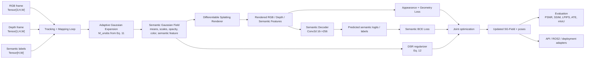

# SLAM-GS3LAM — Pipeline Map

## Verified Paper Identity
- Correct paper: `arXiv:2603.27781`, submitted March 29, 2026
- Conference version: ACM MM 2024, DOI `10.1145/3664647.3680739`
- Official code: `repositories/GS3LAM/`

## End-to-End Pipeline

## Component Mapping
| Paper Component | Paper Ref | Official Repo | Planned ANIMA Target | PRD |
|---|---|---|---|---|
| Semantic Gaussian Field `(mu, Sigma, o, c, f)` | §3.2, Eq. (1)-(2) | `src/Mapper.py`, `src/utils/gaussian_utils.py` | `src/anima_slam_gs3lam/sg_field.py` | PRD-02 |
| Gaussian projection and splatting | §3.2.1, Eq. (3)-(6) | `src/Render.py`, CUDA submodule | `src/anima_slam_gs3lam/rendering/rasterizer.py` | PRD-02 |
| Semantic feature rendering + decoding | §3.2.2, Eq. (7)-(8) | `src/Decoder.py` | `src/anima_slam_gs3lam/semantic/decoder.py` | PRD-02 |
| Decoupled optimization | §3.2.3, Eq. (9) | `src/GS3LAM.py`, `src/Loss.py` | `src/anima_slam_gs3lam/pipeline/slam_loop.py` | PRD-03 |
| Adaptive Gaussian expansion | §3.3.1, Eq. (10)-(11) | `src/Mapper.py:add_new_gaussians_alpha` | `src/anima_slam_gs3lam/mapping/expansion.py` | PRD-03 |
| Depth-adaptive Scale Regularization | §3.3.2, Eq. (12) | `src/Loss.py` regularization block | `src/anima_slam_gs3lam/mapping/regularization.py` | PRD-03 |
| Random Sampling-based Keyframe Mapping | §3.3.3, Eq. (13) | implemented implicitly inside mapping loop / config | `src/anima_slam_gs3lam/mapping/rskm.py` | PRD-03 |
| Mapping objective | §3.3.4, Eq. (14)-(18) | `src/Loss.py` | `src/anima_slam_gs3lam/losses/mapping.py` | PRD-03 |
| Frame-to-model tracking | §3.4, Eq. (19)-(21) | `src/Tracker.py`, `src/Loss.py` | `src/anima_slam_gs3lam/tracking/tracker.py` | PRD-03 |
| Replica / ScanNet / TUM loaders | §4.1.2, README datasets | `src/datasets/*.py` | `src/anima_slam_gs3lam/datasets/*.py` | PRD-01 |
| Benchmark evaluation | §4.2-4.4, Tables 1-4, 9 | `src/Evaluater.py`, scripts | `src/anima_slam_gs3lam/eval/*.py` | PRD-04 |
| Runtime + deployment adaptations | App C.2, Tables 6-7 | repo runtime scripts + visualizers | FastAPI, Docker, ROS2 integration | PRD-05/06/07 |

## Data Contracts
| Artifact | Shape / Type | Source | Consumer |
|---|---|---|---|
| RGB frame | `Tensor[3,H,W]`, float32 in `[0,1]` | dataset loader | tracking, mapping, eval |
| Depth frame | `Tensor[1,H,W]`, float32 meters | dataset loader | expansion, tracking, mapping |
| Semantic label map | `Tensor[H,W]`, int64 | dataset or pseudo labels | semantic loss, mIoU eval |
| Intrinsics | `Tensor[3,3]` | dataset loader | renderer and unprojection |
| Pose | `Tensor[4,4]` | dataset or tracked estimate | tracking, mapping, eval |
| SG-Field semantic feature | `Tensor[N,1,16]` in repo equivalent | SG-Field state | semantic renderer/decoder |
| Decoder logits | `Tensor[256,H,W]` | semantic decoder | BCE / argmax semantics |

## Repo Drift To Preserve Explicitly
- Current repo scaffold package is `src/anima_tsukuyomi/`; target package should be `src/anima_slam_gs3lam/`.
- The paper appendix states ScanNet uses `100/30` tracking/mapping iterations, while the checked-in repo config uses `200/60`.
- The paper discusses 5 ScanNet subsets in prose, but the repo and result table enumerate 6 scenes. The implementation plan follows the 6 explicit scene IDs from the repo and tables.
